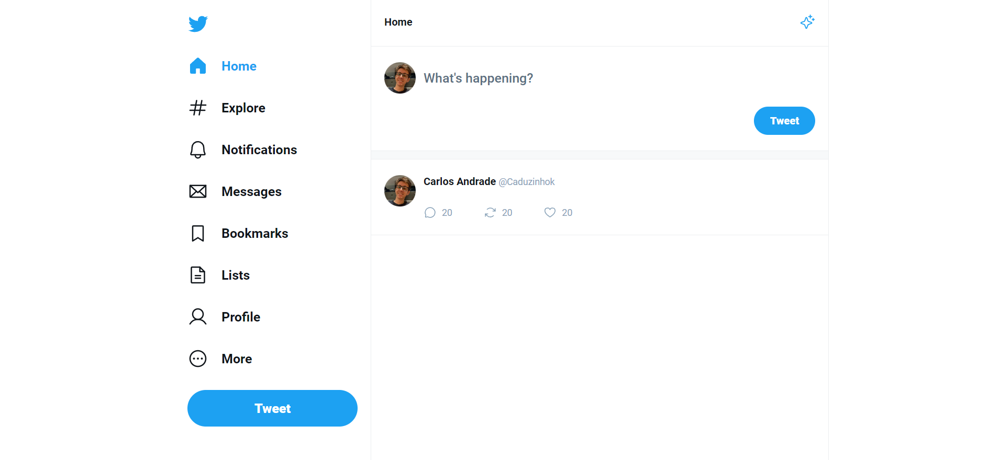
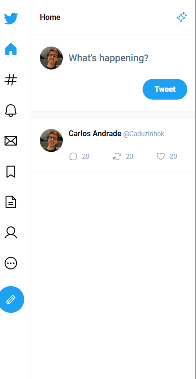

# Twitter Clone - Masterclass Rocketseat

  Usando Vite + React + Typescript

## Finished project

## Mobile View

## What i'm learning

<ul>

<li>
  Phosphor React
</li>
<li>
  React Routes
</li>
<li>
    Event Listeners (OnSubmit, OnKeyDown)
</li>
<li>
    useState, useDebounce
</li>
<li>
    React Router Dom, urlState
</li>
<li>
    Render Flow
</li>
<li>
    Reconciliation Algorithm
</li>
<li>
    Forms Manipulation
</li>
<li>
    props on Typescript (interface)
</li>
<li>
    Compilers and Bundlers
</li>
</ul>

## Do you want to see?
<a href="https://65d7d3be8027295d448e38e8--joyful-douhua-378f68.netlify.app/">Open Here :dart:</a>